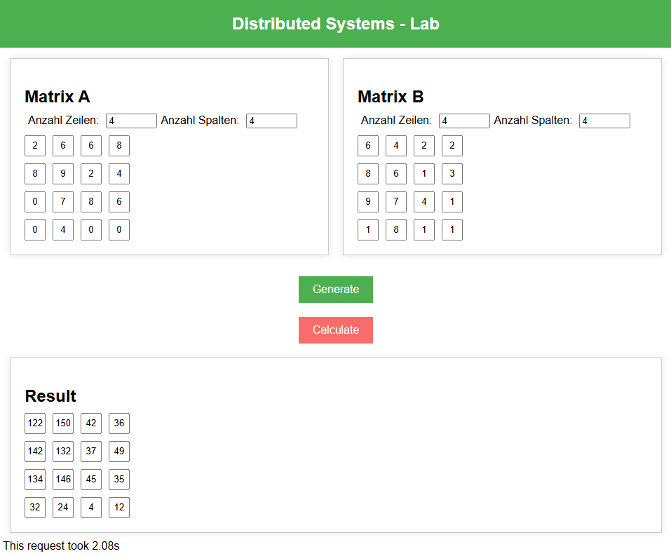
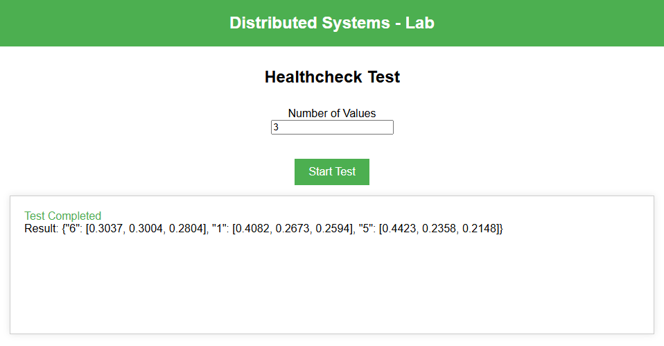
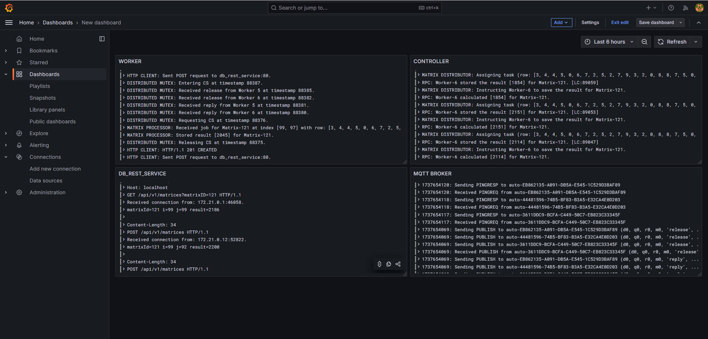
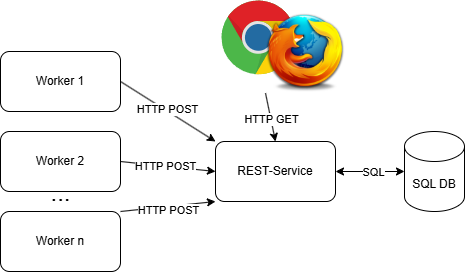
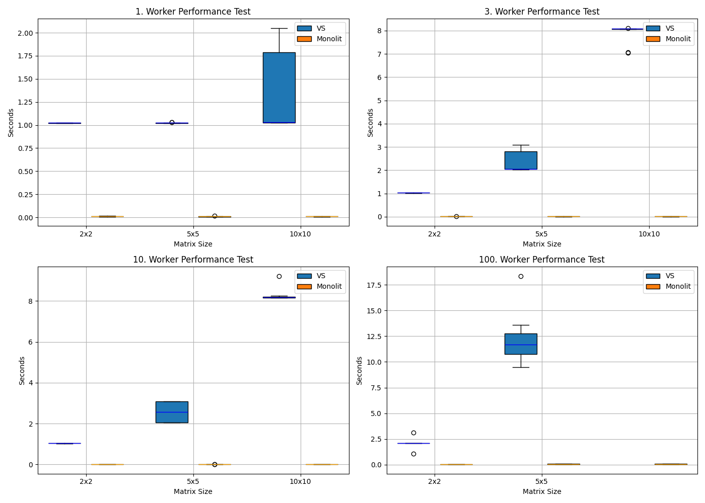

## Prerequisites
- Docker
- Docker Compose

## Components
- **Web**: A frontend application served by Nginx.
- **Controller**: A Flask-based backend server that handles matrix processing, distribution and worker health checks.
- **Worker**: A worker service that registers with the controller and responds to health checks.
- **test_runner**: A test dashboard.
- **Database**: A MariaDB database to store user data.
- **PhpMyAdmin**: A web interface for managing the MariaDB database.
- **db_rest_service**: A REST service for database and client communication.
- **Grafana**: A platform for monitoring and observability.
- **Loki**: A log aggregation system.
- **Promtail**: An agent for collecting logs and sending them to Loki.
- **Mosquitto**: MQTT Message Broker.

## Usage
### Starting the Application
To start the application, run the following command:
```sh
docker-compose up --build
```

This will start all the services defined in the docker-compose.yml file:

- **web** on port 8081
- **controller** on ports 5000 (HTTP) and 5001 (UDP)
- **worker** with 5 replicas, on port 50051 (GRPC)
- **test_runner** on port 8100
- **mariadb** on port 3306
- **phpadmin** on port 8080
- **db_rest_service** on port 80 (HTTP)
- **grafana** on port 3000
- **loki** on port 3100
- **promtail** 
- **mosquitto**

### Stopping the Application
To stop the application, run the following command:
```sh
docker-compose down
```
## Service Usage Guide

### Web Service (Port 8081)

1. Open browser and navigate to `http://localhost:8081`
2. Matrix Input:
   - Enter dimensions for Matrix A and B (2-100)
   - Matrix B rows must match Matrix A columns
   - Click "Generate" to create matrices
3. Calculation:
   - Click "Calculate" to start computation
   - Wait for result display
   - View calculation time below result matrix

### Test Runner Service (Port 8100)

1. Open browser and navigate to `http://localhost:8100`
2. Test Configuration:
   - Select test type:
     * Health Check Test (UDP)
     * HTTP Request Test
     * Performance Test 
   - Enter test parameters:
     * Number of health checks per worker
     * Number of HTTP requests per worker
     * Matrix Size, Number of Calculations per Worker
3. Test Execution:
   - Click "Start Test"
   - View real-time results graph
   - Results saved to:
     * `tests/health_check/` for UDP tests
     * `tests/http_request/` for HTTP tests


### Grafana Service (Port 3000)

1. Access Grafana:
   - Open `http://localhost:3000`
   - Login with e.g.:
     * Username: admin
     * Password: admin

2. Configure Loki Data Source:
   - Go to Connections > Data Sources
   - Add Loki data source:
     * URL: `http://loki:3100`
     * Save & Test
   
3. View Container Logs:
   - Go to Dashboards > Create dashboard > Import dashboard > Import via JSON
   - Use the JSON file located in `grafana/dashboard.json` and click "Load" and "Import"
   - You should now be able to see the dashboard from above

## Architecture
### worker, db_rest_service, mariadb


## Performance
This diagram shows the overall performance compared to the monolithic solution.

